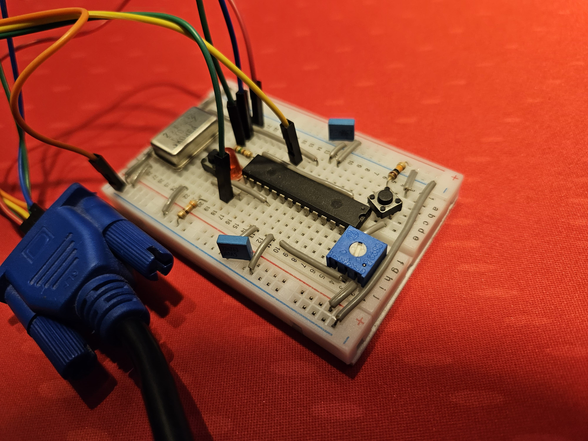
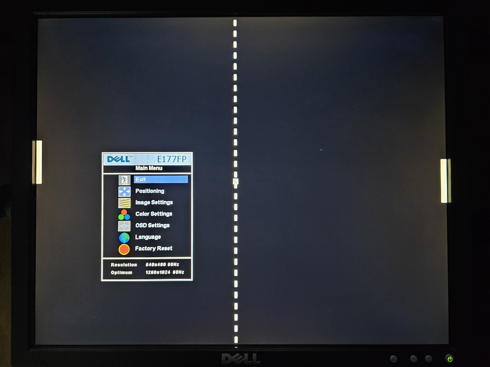
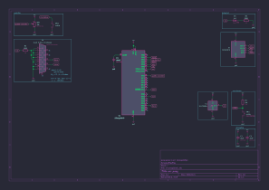

# AVR Pong

## 💻 Sobre o projeto

Jogo Pong de um jogador em um microcontrolador avr (atmega328pa) exibindo a imagem em um monitor vga de resolução 640x480 60Hz de tela visível.

# :scroll: Sumário

- [Funcionalidades](#⚙️-Funcionalidades)
- [Imagens](#🎨-Imagens)

## ⚙️ Funcionalidades

- [ ] Colisão com os paddles.
    - [x] Tratar a colisão do eixo x.
    - [ ] Alterar a direção e/ou inclinação do eixo y da bola no momento da colisão com o paddle.
- [x] Aceleração da bola ao decorrer do jogo.
- [x] Reiniciar o jogo após errar a bola e apertar um botão.
- [ ] Pontuação dos jogadores.
- [ ] Som.
- [ ] Switch para realizar configurações internas.
- [ ] Indutor e capacitor no _AVCC_ para reduzir ruídos (pag. 213 do datasheet)

## 🎨 Imagens

Imagens da montagem do circuito na protoboard:

    
    

> [!NOTE]
> O _trimpot_ foi utilizado para movimentar o _paddle_ do jogador.

Imagem da renderização da tela no monitor vga:

    

> [!NOTE]
> Na imagem da renderização da tela existe uma linha vertical que não aparece, pois foi feita uma centralização da imagem pelas configurações no monitor, proveniente do fato da transferência dos dados das cores ser feita utilizando o _USART_ no modo _Master SPI_, já que quando ele está inativo possui nível lógico alto.

Imagem do esquemático:

    

